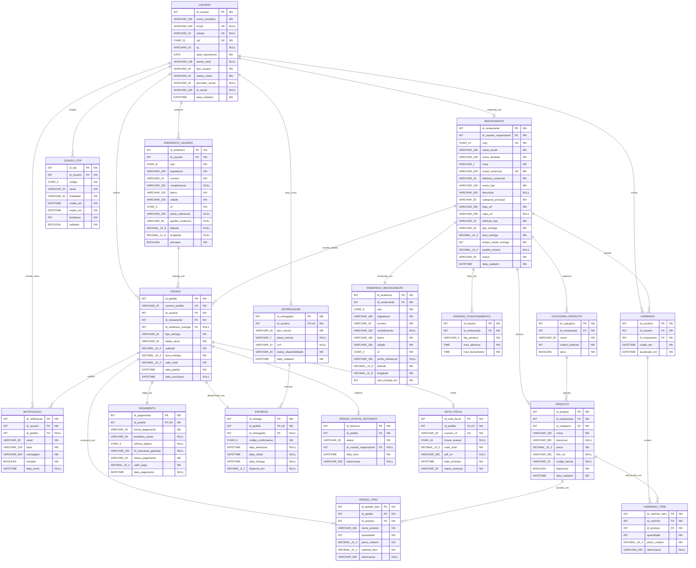

# Yummi — Base de Conhecimento do Projeto

> Clone funcional do iFood — projeto acadêmico da disciplina **SI5 Desenvolvimento de Sistemas de Informação** (Faculdade Impacta).
> Documento consolidado: reúne escopo, requisitos, modelo de dados e decisões tomadas até aqui.

---

## Sumário

1. [Visão geral](#1-visão-geral)
2. [Restrições da disciplina](#2-restrições-da-disciplina)
3. [Escopo — Product Backlog](#3-escopo--product-backlog)
4. [Atores e fluxo do pedido](#4-atores-e-fluxo-do-pedido)
5. [Requisitos — Cadastro de Usuário](#5-requisitos--cadastro-de-usuário)
6. [Requisitos — Cadastro de Restaurante](#6-requisitos--cadastro-de-restaurante)
7. [Modelo de dados físico](#7-modelo-de-dados-físico)
8. [Dicionário de dados](#8-dicionário-de-dados)
9. [O que foi observado no app real do iFood](#9-o-que-foi-observado-no-app-real-do-ifood)
10. [Decisões de modelagem e pontos em aberto](#10-decisões-de-modelagem-e-pontos-em-aberto)
11. [Artefatos e próximos passos](#11-artefatos-e-próximos-passos)

---

## 1. Visão geral

O **Yummi** é uma plataforma de pedidos de comida que conecta clientes a restaurantes parceiros — um clone funcional do iFood. O cliente busca restaurantes, escolhe itens do cardápio, monta o pedido, paga e acompanha a entrega. O restaurante recebe e gerencia os pedidos pela plataforma.

### Problema que resolve

Restaurantes pequenos vendem por canais soltos (WhatsApp, telefone, redes sociais), sem histórico de pedido nem status visível para o cliente. O Yummi centraliza isso: um único lugar para o cliente pedir de qualquer restaurante, e uma ferramenta simples para o restaurante gerenciar cardápio e pedidos.

---

## 2. Restrições da disciplina

Regras vindas do material da aula — **não são opcionais**.

| Restrição | Detalhe |
| --- | --- |
| Banco de dados | **Proibido NoSQL.** O banco deve ser relacional (SQL). |
| Arquitetura | **Obrigatório usar MVC.** |
| Modelo de dados físico | Deve definir: nome dos campos, campos chave, **campos nulos e não nulos**, tipos dos campos, chaves estrangeiras e cardinalidade. O material marca este item como *"ATENÇÃO! Isso será cobrado"*. |
| Processo | SCRUM com 4 sprints, cada uma com entrega avaliada. Cerimônias: backlog, planning, review (entrega) e retrospective, além de weekly. |
| Documento final | Documento formal único que **evolui a cada entrega** — cada sprint gera uma revisão, não um documento novo. |
| Critérios de avaliação | Completude, qualidade, forma e complexidade. |

### Entregas exigidas

- Vídeo explicativo do que foi desenvolvido / evidência de teste
- Git — código e deploy
- Documentação: texto explicativo do funcionamento; pesquisas com referências; especificação funcional (negócio); diagrama de sistema; modelagem e banco de dados
- Documento final do projeto

---

## 3. Escopo — Product Backlog

Lista oficial da disciplina. **É ela que define o escopo** — não o que o iFood real tem.

| Prior. | Bloco | Itens |
| --- | --- | --- |
| 1 | Levantamento | Lista e explicação de todas as funcionalidades do iFood |
| 2 | Autenticação | Celular; e-mail; envio e recebimento de código de validação; integração Gmail; integração Facebook; cadastro de locais |
| 2–3 | Escolha de itens | CRUD Restaurante; CRUD Produto; lista e seleção de parceiro; lista e seleção de produto |
| 4 | Cesta de produtos | Inclusão de produto; exclusão de produto; alteração de quantidade |
| 5 | Fechar pedido | Escolha do tipo de pagamento; integração cartões; seleção do tipo de entrega; notificação push ao cliente; envio de NF em PDF por e-mail |
| 6 | Acompanhamento | Notificação push; alteração de status; tela de acompanhamento; envio e recebimento de código de validação do entregador |
| — | Outros (extras) | AWS (IA, Lambda, banco); NFe e cupom fiscal via SEFAZ; 3 relatórios; envio automático de SMS/WhatsApp/e-mail; integração com redes sociais; cálculo de caminho mínimo com Google Maps; pagamento cartões/PayPal; app mobile; leitor de código de barras; painel de chamada |

> **Fora do escopo:** avaliações de restaurante, cupons de desconto e favoritos **não constam no backlog** da disciplina. Se o grupo quiser incluir, deve ser decisão consciente e documentada como extra.

---

## 4. Atores e fluxo do pedido

| Ator | O que faz |
| --- | --- |
| Cliente | Busca restaurantes, monta o pedido, paga e acompanha a entrega. |
| Restaurante | Cadastra cardápio, recebe e atualiza status dos pedidos. |
| Entregador | Recebe a entrega e atualiza o status até a conclusão. |
| Administrador | Acompanha e gerencia a operação geral da plataforma. |

### Esteira de pedidos (por sprint)

```
Sprint 1 │ Autenticação
         │   e-mail, telefone, integração Facebook, integração Gmail
         │   (+ preparação de infraestrutura, CRUD web e requisitos)
         │
Sprint 2 │ Cadastro Local ──> Consulta Restaurante ──> Consulta Itens
         │   cadastro de endereço (tipo), integração Google Maps
         │
Sprint 3 │ Cadastra Sacola ──> Fechar Pedido ──> Acompanhar Entrega
         │   escolher tipo de entrega, pagamento (integrações)
         │
Sprint 4 │ Itens extras
```

### Status do pedido

Valores usados em `PEDIDO.status_atual` e `PEDIDO_STATUS_HISTORICO.status`, na ordem em que ocorrem:

| # | Status | Quando ocorre |
| --- | --- | --- |
| 1 | `aguardando_pagamento` | Pedido fechado, aguardando confirmação do pagamento. |
| 2 | `aguardando_restaurante` | Pagamento aprovado; aguardando o restaurante aceitar. |
| 3 | `aceito` | Restaurante aceitou o pedido. |
| 4 | `em_preparacao` | Pedido sendo preparado na cozinha. |
| 5 | `pronto_para_entrega` | Pedido pronto, aguardando coleta pelo entregador. |
| 6 | `em_transito` | Entregador coletou e está a caminho do cliente. |
| 7 | `entregue` | Cliente confirmou o recebimento com o código. |
| 8 | `cancelado` | Pedido cancelado pelo cliente, restaurante ou sistema. |

---

## 5. Requisitos — Cadastro de Usuário

### Requisitos funcionais

| Tipo | Funcionalidade |
| --- | --- |
| RF01 — Cadastro de novo usuário | Permite criar conta com nome completo, e-mail ou celular, CPF, data de nascimento e senha. Conta permanece com status "pendente de verificação" até confirmação do código OTP. |
| RF02 — Login por e-mail | Valida o formato do e-mail em tempo real. Exibe "E-mail inválido" abaixo do campo quando inválido. Botão de confirmação permanece desabilitado enquanto o e-mail for inválido. |
| RF03 — Login por celular | Aplica máscara (DD) 9NNNN-NNNN. Limita a entrada a 11 dígitos numéricos. Envia código de verificação via WhatsApp. |
| RF04 — Envio e validação de código (OTP) | Gera código numérico de 6 dígitos. Código expira em 5 minutos. Reenvio liberado após 60 segundos. Bloqueia após 5 tentativas incorretas. |
| RF05 — Login social (Google / Facebook) | Autentica via OAuth2 com Google ou Facebook. Associa automaticamente à conta existente quando o e-mail retornado já está cadastrado. |
| RF06 — Cadastro de endereço | CEP preenche automaticamente rua, bairro, cidade e estado. Usuário informa número, complemento, ponto de referência e apelido do endereço. |
| RF07 — Validação de CPF | Valida os dois dígitos verificadores do CPF pelo algoritmo módulo 11. Rejeita sequências com todos os dígitos iguais. |
| RF08 — Unicidade de identificadores | Bloqueia cadastro com e-mail, celular ou CPF já existentes na base. |
| RF09 — Armazenamento de senha | Senha armazenada apenas como hash com salt (bcrypt ou argon2). Nunca armazenada em texto puro. |
| RF10 — Limite de tentativas (rate limiting) | Login e validação de OTP bloqueiam temporariamente a conta/IP após 5 tentativas incorretas. |
| RF11 — Status de conta | Conta com OTP pendente não realiza login completo. Permite apenas reenvio de código ou nova tentativa de verificação. |

### Requisitos não funcionais

| Tipo | Requisito |
| --- | --- |
| RNF01 — Desempenho | Páginas e telas devem carregar em até 5 segundos, testado manualmente em ambiente local ou de hospedagem gratuita. |
| RNF02 — Escalabilidade | Fora de escopo. Sistema roda em um único servidor/instância, suficiente para demonstração acadêmica. |
| RNF03 — Disponibilidade | Sistema deve estar acessível durante o período de desenvolvimento e apresentação. Sem exigência de SLA de disponibilidade contínua (99%, 99,9% etc.). |
| RNF04 — Segurança de dados | Toda comunicação deve usar HTTPS, obtido automaticamente por serviços de hospedagem gratuitos (ex.: Vercel, Render, Railway, Netlify). Senha nunca é armazenada em texto puro — usar hash com bcrypt. |
| RNF05 — Autenticação e sessão | Login gera token (JWT) válido por 24 horas. Renovação automática (refresh token) não é necessária. |
| RNF06 — Privacidade de dados | Cadastro informa ao usuário para que serão usados CPF, e-mail e celular. Exportação/exclusão automática de dados (LGPD completa) fica fora de escopo, registrada como melhoria futura. |
| RNF07 — Usabilidade | Telas devem ter mensagens de erro claras (ex.: "E-mail inválido") e botões com texto intuitivo. Teste formal de acessibilidade (WCAG) fora de escopo. |
| RNF08 — Compatibilidade | Sistema deve funcionar corretamente no Google Chrome (versão mais recente), com layout responsivo básico para celular. Suporte a outros navegadores é desejável, não obrigatório. |
| RNF09 — Manutenibilidade | Código organizado em camadas (ex.: controller, service, repository/model). Testes automatizados são opcionais — recomenda-se testar manualmente login e pedido antes da entrega. |
| RNF10 — Logs | Erros e ações de login (sucesso/falha) devem aparecer no console ou arquivo de log da aplicação, para apoiar o debug durante o desenvolvimento. |
| RNF11 — Backup | Antes de cada apresentação/entrega, exportar manualmente uma cópia do banco de dados (dump SQL). Backup automático fora de escopo. |
| RNF12 — Portabilidade | Opcional. Uso de Docker facilita rodar o projeto em qualquer máquina do grupo, mas não é obrigatório para a entrega. |

---

## 6. Requisitos — Cadastro de Restaurante

### Requisitos funcionais

| Tipo | Funcionalidade |
| --- | --- |
| RF01 — Cadastro do responsável legal | Coleta nome completo, CPF, RG, e-mail e celular do responsável pela loja. |
| RF02 — Validação de CPF do responsável | Valida os dois dígitos verificadores do CPF pelo algoritmo módulo 11. Rejeita sequências com todos os dígitos iguais. |
| RF03 — Cadastro de dados da empresa | Coleta CNPJ, razão social, nome fantasia, CNAE, e-mail comercial e telefone comercial. |
| RF04 — Validação de CNPJ | Valida os dois dígitos verificadores do CNPJ pelo algoritmo módulo 11. Rejeita sequências com todos os dígitos iguais. |
| RF05 — Cadastro de endereço do restaurante | CEP preenche automaticamente logradouro, bairro, cidade e estado. Usuário completa número, complemento e ponto de referência. Endereço define a área/raio de entrega. |
| RF06 — Cadastro de informações da loja | Coleta nome da loja, descrição, categoria principal, categorias secundárias, logo, capa, horário de funcionamento, telefone da loja e tipo de entrega. |
| RF07 — Upload de logo e capa | Permite envio de imagem para logo e capa da loja, com validação de formato (JPG/PNG) e tamanho máximo de arquivo. |
| RF08 — Configuração de horário de funcionamento | Permite definir intervalo de abertura e fechamento por dia da semana. |
| RF09 — Cadastro de dados bancários | Coleta dados bancários do restaurante para repasse de pagamentos, antes da ativação da loja. |
| RF10 — Fluxo de ativação | Loja permanece com status "pendente" até documentação, endereço, dados bancários e cardápio inicial serem preenchidos. Só então a loja é ativada e passa a receber pedidos. |
| RF11 — Unicidade de identificadores | Bloqueia cadastro com CNPJ ou e-mail comercial já existentes na base. |

### Requisitos não funcionais

| Tipo | Requisito |
| --- | --- |
| RNF01 — Desempenho | Telas de cadastro (documentos, endereço, loja) devem carregar em até 5 segundos, testado manualmente em ambiente local ou de hospedagem gratuita. |
| RNF02 — Escalabilidade | Fora de escopo. Sistema roda em um único servidor/instância, suficiente para demonstração acadêmica. |
| RNF03 — Disponibilidade | Sistema deve estar acessível durante o período de desenvolvimento e apresentação. Sem exigência de SLA de disponibilidade contínua (99%, 99,9% etc.). |
| RNF04 — Segurança de dados | Toda comunicação deve usar HTTPS, obtido automaticamente por serviços de hospedagem gratuitos (ex.: Vercel, Render, Railway, Netlify). CPF, RG e CNPJ nunca aparecem em logs ou em URLs. |
| RNF05 — Upload de arquivos | Logo limitada a 2MB e capa a 5MB, apenas formatos JPG/PNG, validados no front-end e no back-end. |
| RNF06 — Privacidade de dados | Cadastro informa ao usuário para que serão usados CPF, RG e CNPJ. Exportação/exclusão automática de dados (LGPD completa) fica fora de escopo, registrada como melhoria futura. |
| RNF07 — Usabilidade | Cada etapa do cadastro (responsável, empresa, endereço, loja) deve exibir mensagem de erro clara (ex.: "CNPJ inválido", "CEP não encontrado"). Teste formal de acessibilidade (WCAG) fora de escopo. |
| RNF08 — Compatibilidade | Sistema deve funcionar corretamente no Google Chrome (versão mais recente), com layout responsivo básico para celular. Suporte a outros navegadores é desejável, não obrigatório. |
| RNF09 — Manutenibilidade | Código organizado em camadas (ex.: controller, service, repository/model). Testes automatizados são opcionais — recomenda-se testar manualmente o fluxo completo de cadastro antes da entrega. |
| RNF10 — Logs | Falhas de validação (CNPJ, CPF, CEP) e erros de cadastro devem aparecer no console ou arquivo de log da aplicação, para apoiar o debug durante o desenvolvimento. |
| RNF11 — Backup | Antes de cada apresentação/entrega, exportar manualmente uma cópia do banco de dados (dump SQL). Backup automático fora de escopo. |
| RNF12 — Portabilidade | Opcional. Uso de Docker facilita rodar o projeto em qualquer máquina do grupo, mas não é obrigatório para a entrega. |

---

## 7. Modelo de dados físico

**18 tabelas · 166 campos · 26 chaves estrangeiras.** Banco relacional (MySQL 8), conforme a restrição da disciplina.

### Como ler a notação

| Notação | Significado |
| --- | --- |
| `PK` | Chave primária — identifica a linha de forma única. |
| `FK` | Chave estrangeira — aponta para a chave primária de outra tabela. |
| `UK` | Chave única — não permite valores repetidos na coluna. |
| `FK,UK` | Chave estrangeira que também é única — caracteriza uma relação 1:1. |
| `NN` | NOT NULL — preenchimento obrigatório. |
| `NULL` | O campo aceita valor nulo (opcional). |
| `VARCHAR_100` | No diagrama o tipo é escrito com underscore por limitação do Mermaid; equivale a `VARCHAR(100)`. No dicionário de dados os tipos aparecem na notação SQL correta. |

### Diagrama entidade-relacionamento



### Cardinalidade dos relacionamentos

| Relacionamento | Cardin. | Regra de negócio |
| --- | --- | --- |
| `USUARIO → ENDERECO_USUARIO` | **1:N** | Um cliente cadastra vários endereços de entrega. |
| `USUARIO → CODIGO_OTP` | **1:N** | Um usuário recebe vários códigos ao longo do tempo. |
| `USUARIO → RESTAURANTE` | **1:0..1** | Um usuário pode ser responsável por um restaurante. |
| `USUARIO → ENTREGADOR` | **1:0..1** | Um usuário pode ter um cadastro de entregador. |
| `USUARIO → CARRINHO` | **1:N** | Um cliente pode ter sacolas abertas em restaurantes diferentes. |
| `USUARIO → PEDIDO` | **1:N** | Um cliente faz vários pedidos. |
| `USUARIO → NOTIFICACAO` | **1:N** | Um usuário recebe várias notificações. |
| `ENDERECO_USUARIO → PEDIDO` | **1:N** | Um endereço pode ser usado em vários pedidos. |
| `RESTAURANTE → ENDERECO_RESTAURANTE` | **1:1** | Cada restaurante tem exatamente um endereço. |
| `RESTAURANTE → HORARIO_FUNCIONAMENTO` | **1:N** | Um horário por dia da semana. |
| `RESTAURANTE → CATEGORIA_PRODUTO` | **1:N** | Um restaurante organiza várias seções de cardápio. |
| `RESTAURANTE → PRODUTO` | **1:N** | Um restaurante oferece vários produtos. |
| `CATEGORIA_PRODUTO → PRODUTO` | **1:N** | Uma seção agrupa vários produtos. |
| `RESTAURANTE → PEDIDO` | **1:N** | Um restaurante recebe vários pedidos. |
| `CARRINHO → CARRINHO_ITEM` | **1:N** | Uma sacola contém vários itens. |
| `PRODUTO → CARRINHO_ITEM` | **1:N** | Um produto aparece em várias sacolas. |
| `PEDIDO → PEDIDO_ITEM` | **1:N** | Um pedido tem no mínimo um item. |
| `PRODUTO → PEDIDO_ITEM` | **1:N** | Um produto é vendido em vários pedidos. |
| `PEDIDO → PAGAMENTO` | **1:1** | Cada pedido tem um pagamento. |
| `PEDIDO → ENTREGA` | **1:1** | Cada pedido gera uma entrega. |
| `ENTREGADOR → ENTREGA` | **1:N** | Um entregador executa várias entregas. |
| `PEDIDO → PEDIDO_STATUS_HISTORICO` | **1:N** | Um pedido registra várias mudanças de status. |
| `PEDIDO → NOTIFICACAO` | **1:N** | Um pedido dispara várias notificações. |
| `PEDIDO → NOTA_FISCAL` | **1:0..1** | A nota só existe após o pagamento aprovado. |

---

## 8. Dicionário de dados

### Usuário e Autenticação

#### `USUARIO`

*Uma linha por pessoa com login. tipo_usuario define o papel (cliente, restaurante, entregador, administrador), evitando quatro tabelas com os mesmos campos de identificação.*

| Campo | Tipo | Nulo | Chave | Descrição |
| --- | --- | --- | --- | --- |
| `id_usuario` | `INT` | **NN** | **PK** | Identificador do usuário (auto incremento) |
| `nome_completo` | `VARCHAR(100)` | **NN** | — | Nome completo |
| `email` | `VARCHAR(254)` | **NULL** | **UK** | Nulo quando o cadastro foi feito só por celular |
| `celular` | `VARCHAR(15)` | **NULL** | **UK** | Nulo quando o cadastro foi feito só por e-mail |
| `cpf` | `CHAR(11)` | **NN** | **UK** | Somente dígitos; validado por módulo 11 |
| `rg` | `VARCHAR(20)` | **NULL** | — | Preenchido apenas para responsável de restaurante |
| `data_nascimento` | `DATE` | **NN** | — | Idade mínima de 18 anos |
| `senha_hash` | `VARCHAR(128)` | **NULL** | — | Nulo quando o acesso é somente por Google/Facebook |
| `tipo_usuario` | `VARCHAR(20)` | **NN** | — | cliente \| restaurante \| entregador \| admin |
| `status_conta` | `VARCHAR(20)` | **NN** | — | pendente \| ativo \| bloqueado |
| `provedor_social` | `VARCHAR(20)` | **NULL** | — | google \| facebook; nulo no cadastro tradicional |
| `id_social` | `VARCHAR(100)` | **NULL** | — | ID retornado pelo provedor OAuth2 |
| `data_cadastro` | `DATETIME` | **NN** | — | Data e hora da criação da conta |

#### `ENDERECO_USUARIO`

*Um cliente pode ter vários endereços (casa, trabalho). Latitude e longitude vêm da integração com mapas.*

| Campo | Tipo | Nulo | Chave | Descrição |
| --- | --- | --- | --- | --- |
| `id_endereco` | `INT` | **NN** | **PK** | Identificador do endereço |
| `id_usuario` | `INT` | **NN** | **FK** | → USUARIO.id_usuario |
| `cep` | `CHAR(8)` | **NN** | — | Somente dígitos |
| `logradouro` | `VARCHAR(150)` | **NN** | — | Preenchido pela API de CEP |
| `numero` | `VARCHAR(10)` | **NN** | — | Aceita letras (ex.: 123A) |
| `complemento` | `VARCHAR(100)` | **NULL** | — | Apartamento, bloco etc. |
| `bairro` | `VARCHAR(100)` | **NN** | — | Preenchido pela API de CEP |
| `cidade` | `VARCHAR(100)` | **NN** | — | Preenchido pela API de CEP |
| `uf` | `CHAR(2)` | **NN** | — | Sigla de UF válida |
| `ponto_referencia` | `VARCHAR(150)` | **NULL** | — | Campo livre |
| `apelido_endereco` | `VARCHAR(50)` | **NULL** | — | Casa, Trabalho etc. |
| `latitude` | `DECIMAL(10,8)` | **NULL** | — | Preenchido pela integração de mapas |
| `longitude` | `DECIMAL(11,8)` | **NULL** | — | Preenchido pela integração de mapas |
| `principal` | `BOOLEAN` | **NN** | — | Indica o endereço padrão de entrega |

#### `CODIGO_OTP`

*Histórico de códigos de verificação enviados. Guardar o histórico permite auditar tentativas e bloquear abuso.*

| Campo | Tipo | Nulo | Chave | Descrição |
| --- | --- | --- | --- | --- |
| `id_otp` | `INT` | **NN** | **PK** | Identificador do código |
| `id_usuario` | `INT` | **NN** | **FK** | → USUARIO.id_usuario |
| `codigo` | `CHAR(6)` | **NN** | — | Código numérico de 6 dígitos |
| `canal` | `VARCHAR(20)` | **NN** | — | whatsapp \| sms \| email |
| `finalidade` | `VARCHAR(20)` | **NN** | — | cadastro \| login |
| `criado_em` | `DATETIME` | **NN** | — | Momento da geração |
| `expira_em` | `DATETIME` | **NN** | — | criado_em + 5 minutos |
| `tentativas` | `INT` | **NN** | — | Contador de validações incorretas (máx. 5) |
| `validado` | `BOOLEAN` | **NN** | — | Indica se o código já foi usado com sucesso |

### Restaurante e Cardápio

#### `RESTAURANTE`

*Dados da empresa e da loja. Nome, CPF, RG, e-mail e celular do responsável não se repetem aqui — vêm de USUARIO via id_usuario_responsavel.*

| Campo | Tipo | Nulo | Chave | Descrição |
| --- | --- | --- | --- | --- |
| `id_restaurante` | `INT` | **NN** | **PK** | Identificador do restaurante |
| `id_usuario_responsavel` | `INT` | **NN** | **FK** | → USUARIO.id_usuario (responsável legal) |
| `cnpj` | `CHAR(14)` | **NN** | **UK** | Somente dígitos; validado por módulo 11 |
| `razao_social` | `VARCHAR(150)` | **NN** | — | Razão social registrada |
| `nome_fantasia` | `VARCHAR(100)` | **NN** | — | Nome fantasia registrado |
| `cnae` | `VARCHAR(7)` | **NN** | — | Deve corresponder a atividade de alimentação |
| `email_comercial` | `VARCHAR(254)` | **NN** | **UK** | E-mail da empresa |
| `telefone_comercial` | `VARCHAR(15)` | **NN** | — | Somente dígitos, com DDI |
| `nome_loja` | `VARCHAR(100)` | **NN** | — | Nome exibido ao cliente no app |
| `descricao` | `VARCHAR(500)` | **NULL** | — | Texto livre de apresentação da loja |
| `categoria_principal` | `VARCHAR(50)` | **NN** | — | Lanches, Pizza, Japonesa etc. |
| `logo_url` | `VARCHAR(255)` | **NN** | — | Caminho da imagem (JPG/PNG, máx. 2MB) |
| `capa_url` | `VARCHAR(255)` | **NULL** | — | Caminho da imagem (JPG/PNG, máx. 5MB) |
| `telefone_loja` | `VARCHAR(15)` | **NN** | — | Telefone exibido ao cliente |
| `tipo_entrega` | `VARCHAR(20)` | **NN** | — | propria \| plataforma \| ambas |
| `taxa_entrega` | `DECIMAL(10,2)` | **NN** | — | Valor cobrado pela entrega |
| `tempo_medio_entrega` | `INT` | **NN** | — | Tempo estimado em minutos |
| `pedido_minimo` | `DECIMAL(10,2)` | **NULL** | — | Nulo quando não há valor mínimo |
| `status` | `VARCHAR(20)` | **NN** | — | pendente \| ativo \| inativo |
| `data_cadastro` | `DATETIME` | **NN** | — | Data e hora do cadastro |

#### `ENDERECO_RESTAURANTE`

*Relação 1:1 — o restaurante tem um endereço fixo. Latitude, longitude e raio são obrigatórios porque definem a área de entrega.*

| Campo | Tipo | Nulo | Chave | Descrição |
| --- | --- | --- | --- | --- |
| `id_endereco` | `INT` | **NN** | **PK** | Identificador do endereço |
| `id_restaurante` | `INT` | **NN** | **FK** | → RESTAURANTE.id_restaurante |
| `cep` | `CHAR(8)` | **NN** | — | Somente dígitos |
| `logradouro` | `VARCHAR(150)` | **NN** | — | Preenchido pela API de CEP |
| `numero` | `VARCHAR(10)` | **NN** | — | Aceita letras |
| `complemento` | `VARCHAR(100)` | **NULL** | — | Sala, loja etc. |
| `bairro` | `VARCHAR(100)` | **NN** | — | Preenchido pela API de CEP |
| `cidade` | `VARCHAR(100)` | **NN** | — | Preenchido pela API de CEP |
| `uf` | `CHAR(2)` | **NN** | — | Sigla de UF válida |
| `ponto_referencia` | `VARCHAR(150)` | **NULL** | — | Campo livre |
| `latitude` | `DECIMAL(10,8)` | **NN** | — | Origem do cálculo de distância da entrega |
| `longitude` | `DECIMAL(11,8)` | **NN** | — | Origem do cálculo de distância da entrega |
| `raio_entrega_km` | `INT` | **NN** | — | Distância máxima atendida, em quilômetros |

#### `HORARIO_FUNCIONAMENTO`

*Uma linha por dia da semana em que a loja abre — permite horário diferente em cada dia e dias fechados (simplesmente sem linha).*

| Campo | Tipo | Nulo | Chave | Descrição |
| --- | --- | --- | --- | --- |
| `id_horario` | `INT` | **NN** | **PK** | Identificador do horário |
| `id_restaurante` | `INT` | **NN** | **FK** | → RESTAURANTE.id_restaurante |
| `dia_semana` | `VARCHAR(3)` | **NN** | — | SEG \| TER \| QUA \| QUI \| SEX \| SAB \| DOM |
| `hora_abertura` | `TIME` | **NN** | — | Horário de abertura |
| `hora_fechamento` | `TIME` | **NN** | — | Horário de fechamento |

#### `CATEGORIA_PRODUTO`

*Seções do cardápio de cada restaurante (Entradas, Pratos, Bebidas). Cada restaurante define as suas.*

| Campo | Tipo | Nulo | Chave | Descrição |
| --- | --- | --- | --- | --- |
| `id_categoria` | `INT` | **NN** | **PK** | Identificador da categoria |
| `id_restaurante` | `INT` | **NN** | **FK** | → RESTAURANTE.id_restaurante |
| `nome` | `VARCHAR(50)` | **NN** | — | Nome da seção do cardápio |
| `ordem_exibicao` | `INT` | **NN** | — | Define a ordem das seções na tela |
| `ativa` | `BOOLEAN` | **NN** | — | Permite ocultar a seção sem apagá-la |

#### `PRODUTO`

*Item do cardápio. Nunca é apagado quando sai de linha — usa-se disponivel = false, para não quebrar pedidos antigos que o referenciam.*

| Campo | Tipo | Nulo | Chave | Descrição |
| --- | --- | --- | --- | --- |
| `id_produto` | `INT` | **NN** | **PK** | Identificador do produto |
| `id_restaurante` | `INT` | **NN** | **FK** | → RESTAURANTE.id_restaurante |
| `id_categoria` | `INT` | **NN** | **FK** | → CATEGORIA_PRODUTO.id_categoria |
| `nome` | `VARCHAR(100)` | **NN** | — | Nome do produto |
| `descricao` | `VARCHAR(500)` | **NULL** | — | Ingredientes, porção etc. |
| `preco` | `DECIMAL(10,2)` | **NN** | — | Preço atual de venda |
| `foto_url` | `VARCHAR(255)` | **NULL** | — | Caminho da imagem do produto |
| `codigo_barras` | `VARCHAR(13)` | **NULL** | — | EAN-13; usado pelo leitor de código de barras |
| `disponivel` | `BOOLEAN` | **NN** | — | Falso oculta o item do cardápio |
| `data_cadastro` | `DATETIME` | **NN** | — | Data e hora do cadastro |

### Sacola e Pedido

#### `CARRINHO`

*Sacola em aberto do cliente, antes de virar pedido. Guarda id_restaurante porque a sacola é de um restaurante só.*

| Campo | Tipo | Nulo | Chave | Descrição |
| --- | --- | --- | --- | --- |
| `id_carrinho` | `INT` | **NN** | **PK** | Identificador do carrinho |
| `id_usuario` | `INT` | **NN** | **FK** | → USUARIO.id_usuario |
| `id_restaurante` | `INT` | **NN** | **FK** | → RESTAURANTE.id_restaurante |
| `criado_em` | `DATETIME` | **NN** | — | Momento em que a sacola foi aberta |
| `atualizado_em` | `DATETIME` | **NN** | — | Última inclusão, exclusão ou alteração |

#### `CARRINHO_ITEM`

*Itens da sacola. Inclusão, exclusão e alteração de quantidade operam nesta tabela.*

| Campo | Tipo | Nulo | Chave | Descrição |
| --- | --- | --- | --- | --- |
| `id_carrinho_item` | `INT` | **NN** | **PK** | Identificador do item |
| `id_carrinho` | `INT` | **NN** | **FK** | → CARRINHO.id_carrinho |
| `id_produto` | `INT` | **NN** | **FK** | → PRODUTO.id_produto |
| `quantidade` | `INT` | **NN** | — | Quantidade do item (mínimo 1) |
| `preco_unitario` | `DECIMAL(10,2)` | **NN** | — | Preço no momento em que foi adicionado |
| `observacao` | `VARCHAR(200)` | **NULL** | — | Ex.: sem cebola |

#### `PEDIDO`

*Pedido fechado. status_atual é redundante em relação ao histórico, mas evita uma subconsulta a cada listagem de pedidos.*

| Campo | Tipo | Nulo | Chave | Descrição |
| --- | --- | --- | --- | --- |
| `id_pedido` | `INT` | **NN** | **PK** | Identificador interno do pedido |
| `numero_pedido` | `VARCHAR(20)` | **NN** | **UK** | Número exibido ao cliente e ao restaurante |
| `id_usuario` | `INT` | **NN** | **FK** | → USUARIO.id_usuario (cliente) |
| `id_restaurante` | `INT` | **NN** | **FK** | → RESTAURANTE.id_restaurante |
| `id_endereco_entrega` | `INT` | **NULL** | **FK** | → ENDERECO_USUARIO; nulo quando é retirada no local |
| `tipo_entrega` | `VARCHAR(20)` | **NN** | — | delivery \| retirada |
| `status_atual` | `VARCHAR(30)` | **NN** | — | Ver tabela de domínio de status |
| `subtotal` | `DECIMAL(10,2)` | **NN** | — | Soma dos itens, sem a taxa |
| `taxa_entrega` | `DECIMAL(10,2)` | **NN** | — | Valor da entrega no momento do pedido |
| `valor_total` | `DECIMAL(10,2)` | **NN** | — | subtotal + taxa_entrega |
| `data_pedido` | `DATETIME` | **NN** | — | Momento do fechamento do pedido |
| `data_conclusao` | `DATETIME` | **NULL** | — | Preenchido quando o pedido é entregue ou cancelado |

#### `PEDIDO_ITEM`

*Itens do pedido. Copia nome e preço do produto no momento da compra — se o restaurante mudar o preço depois, o pedido antigo continua correto.*

| Campo | Tipo | Nulo | Chave | Descrição |
| --- | --- | --- | --- | --- |
| `id_pedido_item` | `INT` | **NN** | **PK** | Identificador do item |
| `id_pedido` | `INT` | **NN** | **FK** | → PEDIDO.id_pedido |
| `id_produto` | `INT` | **NN** | **FK** | → PRODUTO.id_produto |
| `nome_produto` | `VARCHAR(100)` | **NN** | — | Cópia do nome no momento da compra |
| `quantidade` | `INT` | **NN** | — | Quantidade comprada |
| `preco_unitario` | `DECIMAL(10,2)` | **NN** | — | Cópia do preço no momento da compra |
| `subtotal_item` | `DECIMAL(10,2)` | **NN** | — | quantidade × preco_unitario |
| `observacao` | `VARCHAR(200)` | **NULL** | — | Observação enviada ao restaurante |

### Pagamento, Entrega e Acompanhamento

#### `PAGAMENTO`

*Um pagamento por pedido (por isso id_pedido é FK e UK). Nunca armazena o número completo do cartão — apenas bandeira e últimos 4 dígitos, com a cobrança feita pelo gateway.*

| Campo | Tipo | Nulo | Chave | Descrição |
| --- | --- | --- | --- | --- |
| `id_pagamento` | `INT` | **NN** | **PK** | Identificador do pagamento |
| `id_pedido` | `INT` | **NN** | **FK,UK** | → PEDIDO.id_pedido (relação 1:1) |
| `forma_pagamento` | `VARCHAR(20)` | **NN** | — | credito \| debito \| pix \| paypal \| dinheiro |
| `bandeira_cartao` | `VARCHAR(20)` | **NULL** | — | Nulo quando não é pagamento com cartão |
| `ultimos_digitos` | `CHAR(4)` | **NULL** | — | Apenas para exibição; nunca o número completo |
| `id_transacao_gateway` | `VARCHAR(100)` | **NULL** | — | Identificador devolvido pelo gateway |
| `status_pagamento` | `VARCHAR(20)` | **NN** | — | pendente \| aprovado \| recusado \| estornado |
| `valor_pago` | `DECIMAL(10,2)` | **NN** | — | Valor efetivamente cobrado |
| `data_pagamento` | `DATETIME` | **NULL** | — | Nulo enquanto o pagamento não é confirmado |

#### `ENTREGADOR`

*Dados específicos do entregador. O login, nome e CPF ficam em USUARIO — aqui só entram os dados que os outros papéis não têm.*

| Campo | Tipo | Nulo | Chave | Descrição |
| --- | --- | --- | --- | --- |
| `id_entregador` | `INT` | **NN** | **PK** | Identificador do entregador |
| `id_usuario` | `INT` | **NN** | **FK,UK** | → USUARIO.id_usuario (relação 1:1) |
| `tipo_veiculo` | `VARCHAR(20)` | **NN** | — | moto \| bicicleta \| carro \| a_pe |
| `placa_veiculo` | `VARCHAR(7)` | **NULL** | — | Nulo para bicicleta ou a pé |
| `cnh` | `VARCHAR(11)` | **NULL** | — | Nulo para bicicleta ou a pé |
| `status_disponibilidade` | `VARCHAR(20)` | **NN** | — | disponivel \| em_entrega \| offline |
| `data_cadastro` | `DATETIME` | **NN** | — | Data e hora do cadastro |

#### `ENTREGA`

*Uma entrega por pedido. id_entregador fica nulo até um entregador aceitar a corrida. O código de confirmação é informado pelo cliente ao receber.*

| Campo | Tipo | Nulo | Chave | Descrição |
| --- | --- | --- | --- | --- |
| `id_entrega` | `INT` | **NN** | **PK** | Identificador da entrega |
| `id_pedido` | `INT` | **NN** | **FK,UK** | → PEDIDO.id_pedido (relação 1:1) |
| `id_entregador` | `INT` | **NULL** | **FK** | → ENTREGADOR; nulo antes da atribuição |
| `codigo_confirmacao` | `CHAR(6)` | **NN** | — | Código que o cliente informa na entrega |
| `data_atribuicao` | `DATETIME` | **NULL** | — | Momento em que o entregador aceitou |
| `data_coleta` | `DATETIME` | **NULL** | — | Momento da retirada no restaurante |
| `data_entrega` | `DATETIME` | **NULL** | — | Momento da entrega confirmada |
| `distancia_km` | `DECIMAL(6,2)` | **NULL** | — | Calculada pela integração de mapas |

#### `PEDIDO_STATUS_HISTORICO`

*Uma linha por mudança de status. É o que alimenta a tela de acompanhamento em tempo real e permite auditar quem mudou o quê.*

| Campo | Tipo | Nulo | Chave | Descrição |
| --- | --- | --- | --- | --- |
| `id_historico` | `INT` | **NN** | **PK** | Identificador do registro |
| `id_pedido` | `INT` | **NN** | **FK** | → PEDIDO.id_pedido |
| `status` | `VARCHAR(30)` | **NN** | — | Ver tabela de domínio de status |
| `id_usuario_responsavel` | `INT` | **NULL** | **FK** | → USUARIO; nulo quando a mudança é automática |
| `data_hora` | `DATETIME` | **NN** | — | Momento exato da mudança |
| `observacao` | `VARCHAR(200)` | **NULL** | — | Ex.: motivo do cancelamento |

#### `NOTIFICACAO`

*Registro de avisos enviados ao usuário (push, SMS, WhatsApp, e-mail). Guardar o envio permite reenviar e comprovar o que foi comunicado.*

| Campo | Tipo | Nulo | Chave | Descrição |
| --- | --- | --- | --- | --- |
| `id_notificacao` | `INT` | **NN** | **PK** | Identificador da notificação |
| `id_usuario` | `INT` | **NN** | **FK** | → USUARIO.id_usuario (destinatário) |
| `id_pedido` | `INT` | **NULL** | **FK** | → PEDIDO; nulo em avisos não ligados a pedido |
| `canal` | `VARCHAR(20)` | **NN** | — | push \| sms \| whatsapp \| email |
| `titulo` | `VARCHAR(100)` | **NN** | — | Título exibido na notificação |
| `mensagem` | `VARCHAR(500)` | **NN** | — | Corpo da mensagem |
| `enviada` | `BOOLEAN` | **NN** | — | Falso indica falha ou envio pendente |
| `data_envio` | `DATETIME` | **NULL** | — | Nulo enquanto não foi enviada |

#### `NOTA_FISCAL`

*Nota fiscal do pedido, enviada em PDF por e-mail. Só existe depois que o pagamento é aprovado — por isso a relação com PEDIDO é opcional (0 ou 1).*

| Campo | Tipo | Nulo | Chave | Descrição |
| --- | --- | --- | --- | --- |
| `id_nota_fiscal` | `INT` | **NN** | **PK** | Identificador da nota |
| `id_pedido` | `INT` | **NN** | **FK,UK** | → PEDIDO.id_pedido (relação 1:1) |
| `numero_nf` | `VARCHAR(20)` | **NN** | **UK** | Número da nota fiscal emitida |
| `chave_acesso` | `CHAR(44)` | **NULL** | — | Chave de acesso da NFe (SEFAZ) |
| `valor_total` | `DECIMAL(10,2)` | **NN** | — | Valor total da nota |
| `pdf_url` | `VARCHAR(255)` | **NULL** | — | Caminho do PDF gerado |
| `data_emissao` | `DATETIME` | **NN** | — | Momento da emissão |
| `status_emissao` | `VARCHAR(20)` | **NN** | — | pendente \| emitida \| rejeitada |

---

## 9. O que foi observado no app real do iFood

Levantado navegando no site do iFood e inspecionando o formulário de login/cadastro. **Estes pontos são fato observado**, não suposição:

| Aspecto | O que foi observado |
| --- | --- |
| Opções de login | Facebook, Google, Celular e E-mail — nessa ordem na tela. |
| Campo de celular | Máscara automática `(DD) 9NNNN-NNNN`; a entrada trava em 11 dígitos (o 12º é ignorado). Prefixo de país `+55` fica em um seletor separado. |
| Envio do código | O botão de ação é rotulado **WhatsApp**, não SMS — o WhatsApp é o canal padrão. |
| Validação de e-mail | Ocorre em tempo real: exibe "E-mail inválido" abaixo do campo e mantém o botão "Continuar" desabilitado enquanto o valor for inválido. |
| Atributos HTML | Os inputs não usam `maxlength`, `pattern` nem `type="email"` — toda a validação e a máscara são feitas em JavaScript. |

### Origem de cada limite de campo

Importante saber separar na hora de apresentar — o professor pode perguntar de onde vieram os números:

| Origem | Quais valores |
| --- | --- |
| Confirmado no app do iFood | Limite de 11 dígitos do celular; máscara de exibição; canal WhatsApp; validação de e-mail em tempo real. |
| Padrão brasileiro / norma técnica | CPF = 11 dígitos com 2 verificadores (módulo 11); CNPJ = 14 dígitos; CEP = 8 dígitos; UF = 2 letras; e-mail até 254 caracteres (limite do padrão SMTP); CNAE = 7 dígitos; chave de acesso da NFe = 44 dígitos. |
| Definido pelo grupo | Tamanhos de nome, razão social, descrição, observação etc. O iFood não publica essas definições internas — são decisões de projeto, e é assim que devem ser apresentadas. |

---

## 10. Decisões de modelagem e pontos em aberto

### Decisões tomadas

- **`USUARIO` única para os 4 papéis** — Em vez de quatro tabelas (cliente, restaurante, entregador, admin) com os mesmos campos de identificação, existe uma tabela `USUARIO` com o campo `tipo_usuario`. Evita repetir nome, CPF e e-mail quatro vezes. **Custo:** alguns campos ficam nulos conforme o papel (`rg` só é usado por responsável de restaurante). *Se o professor preferir tabelas separadas por ator, a mudança é pequena.*

- **Endereço do cliente é 1:N, do restaurante é 1:1** — O cliente pode ter casa e trabalho; a loja tem um endereço fixo.

- **`PEDIDO_ITEM` copia nome e preço do produto** — Se o restaurante mudar o preço depois, o pedido antigo continua com o valor correto. Sem essa cópia, o histórico ficaria errado.

- **Produto nunca é apagado** — Usa-se `disponivel = false`. Apagar quebraria pedidos antigos que referenciam o produto.

- **`PEDIDO.status_atual` é redundante** — O histórico completo está em `PEDIDO_STATUS_HISTORICO`, mas repetir o status atual em `PEDIDO` evita uma subconsulta a cada listagem de pedidos. Redundância consciente, por desempenho.

- **Cartão nunca é armazenado** — Só bandeira e últimos 4 dígitos, para exibição. A cobrança é responsabilidade do gateway, que devolve `id_transacao_gateway`.

- **`ENTREGA.codigo_confirmacao`** — Atende o item do backlog "envio e recebimento de código de validação do entregador" — o cliente informa o código ao receber o pedido.

- **Senha e OTP** — `senha_hash` aceita nulo porque o usuário pode entrar só por Google/Facebook. O histórico de OTP é guardado para auditar tentativas e bloquear abuso.

### Pontos em aberto

- **Dados bancários do restaurante** (RF09) ainda não têm tabela no modelo — falta definir se guardamos os dados ou apenas um identificador devolvido pelo gateway. *Recomendação: guardar só o identificador do gateway, para não ter dado bancário no banco.*
- **Categorias secundárias do restaurante** estão como campo texto no requisito, mas o ideal é uma tabela de ligação `RESTAURANTE_CATEGORIA`. Decidir antes de implementar.
- **Relatórios** (3, exigidos no backlog) ainda não foram escolhidos — definir quais na Sprint 4.
- **Tabela de administrador** não existe separada: o admin é um `USUARIO` com `tipo_usuario = 'admin'`. Confirmar se atende.
- **Requisitos de Cardápio/Produto e Pedido** ainda não foram escritos no formato dos módulos 5 e 6 — o modelo de dados já os cobre, mas falta o documento de requisitos.

---

## 11. Artefatos e próximos passos

### Já produzidos

| Arquivo | Conteúdo |
| --- | --- |
| `Requisitos Cadastro Usuario.docx` | RF, dicionário de dados e RNF do módulo de autenticação/cadastro |
| `Requisitos Cadastro Restaurante.docx` | RF, dicionário de dados e RNF do módulo de cadastro de restaurante |
| `Yummi_Modelo_Dados_Fisico.docx` | Modelo físico completo: notação, cardinalidade, diagrama e dicionário campo a campo |
| `Yummi_Diagrama_Modelo_Fisico.png` | Diagrama ER em alta resolução, para slides e para o documento final |
| `yummi_schema.sql` | Script MySQL 8 com as 18 tabelas, PK/FK/UK, CHECKs e índices |
| `YUMMI_PROJETO.md` | Este documento — base de conhecimento consolidada |

### Verificação feita

- O SQL foi executado de verdade em um banco em memória: as 18 tabelas foram criadas e a integridade referencial bloqueou um insert com usuário inexistente.
- Um script compara **diagrama × dicionário × SQL** campo a campo (tipo, nulidade e chave) e confirma que os três estão idênticos: 18 tabelas, 166 campos, 26 FKs.

### Próximos passos sugeridos

1. Escrever os requisitos de **Cardápio/Produto** e de **Pedido** no mesmo formato dos módulos 5 e 6.
2. Montar o **diagrama de arquitetura** do sistema (o material traz um exemplo: frontend, backend, banco, e as APIs externas — ViaCEP, Google Maps, gateway de pagamento, Meta/Google para login social).
3. Resolver os pontos em aberto da seção 10, principalmente dados bancários e categorias secundárias.
4. Definir a stack (front, back, banco) e registrar no documento final — é uma das entregas pedidas.
